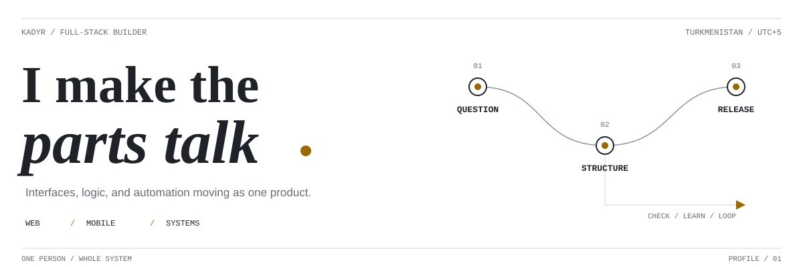
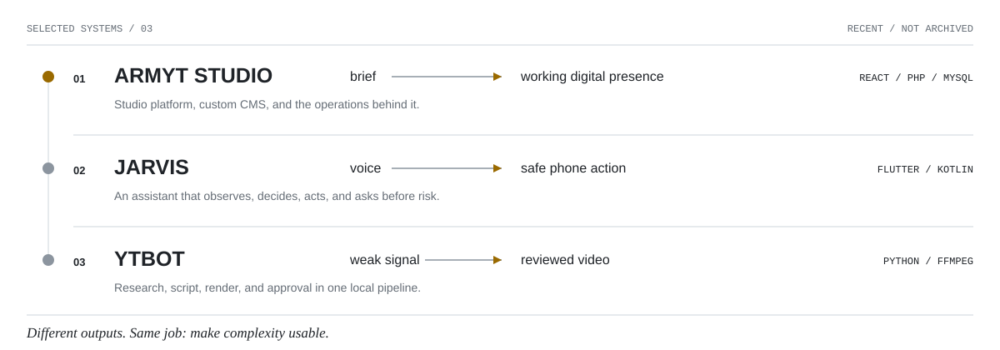

<picture>
  <source media="(prefers-color-scheme: dark) and (max-width: 600px)" srcset="./assets/header-mobile-dark.svg">
  <source media="(prefers-color-scheme: light) and (max-width: 600px)" srcset="./assets/header-mobile-light.svg">
  <source media="(prefers-color-scheme: dark)" srcset="./assets/header-dark.svg">
  <source media="(prefers-color-scheme: light)" srcset="./assets/header-light.svg">
  
</picture>

I build products end to end: the interface, the awkward backend parts, and the
automation that keeps the whole thing moving. My work usually starts with a real
problem and ends with something people can actually use.

## Recent builds

**01 / ARMYT STUDIO**  
A multilingual studio platform with a custom CMS, orders, reviews, and a secured
admin workflow.

`React` `TypeScript` `PHP` `MySQL`

**02 / JARVIS**  
A voice-first Android assistant that reads the current interface, chooses the
next action, and asks before anything sensitive happens.

`Flutter` `Dart` `Kotlin` `Gemini`

**03 / YTBOT**  
A local, human-in-the-loop pipeline for researching, scripting, rendering, and
reviewing short-form video.

`Python` `FastAPI` `FFmpeg` `SQLite`

<picture>
  <source media="(prefers-color-scheme: dark) and (max-width: 600px)" srcset="./assets/range-mobile-dark.svg">
  <source media="(prefers-color-scheme: light) and (max-width: 600px)" srcset="./assets/range-mobile-light.svg">
  <source media="(prefers-color-scheme: dark)" srcset="./assets/range-dark.svg">
  <source media="(prefers-color-scheme: light)" srcset="./assets/range-light.svg">
  
</picture>

## How I work

- Start from the behavior, then choose the stack.
- Keep dangerous actions explicit and reversible.
- Prefer a small working system over a large theoretical one.
- Use AI as part of the toolchain, not as the product's personality.

## Contact

The shortest route is [Telegram](https://t.me/its_n0t_me). I am based in
Turkmenistan and work across web, mobile, and automation projects.
