<div align="center">



<br/>

<a href="https://t.me/its_n0t_me"><b>telegram</b></a>
&nbsp;&nbsp;·&nbsp;&nbsp;
<a href="mailto:gigaforce13@gmail.com"><b>email</b></a>
&nbsp;&nbsp;·&nbsp;&nbsp;
<a href="https://github.com/ihidna"><b>github</b></a>

</div>

<br/>

```txt
> not collecting technologies.
> building systems that feel simple on the outside
> and do the complicated work underneath.
```

<table>
<tr>
<td width="33%" valign="top">

### 01 / PRODUCT
Interfaces with intent.  
Clean flows, sharp details, less noise.

</td>
<td width="33%" valign="top">

### 02 / ENGINE
APIs, data, business logic.  
The invisible part that makes it real.

</td>
<td width="33%" valign="top">

### 03 / AUTOMATE
Tools that remove repetition.  
If a machine can do it, it probably should.

</td>
</tr>
</table>

<br/>

### `selected transmissions`

**DURNA** — marketplace / commerce system  
**ARMYT STUDIO** — digital products + creative infrastructure  
**JARVIS** — automation experiments and personal tooling

<br/>

```ts
while (curious) {
  design();
  build();
  breakThings();
  understandWhy();
  ship();
}
```

<div align="right">
<sub>soft pixels / hard logic — ihidna</sub>
</div>
